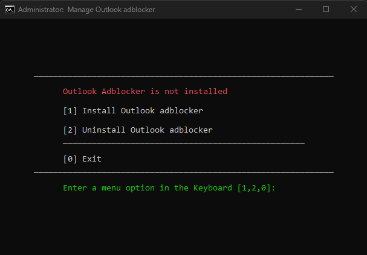
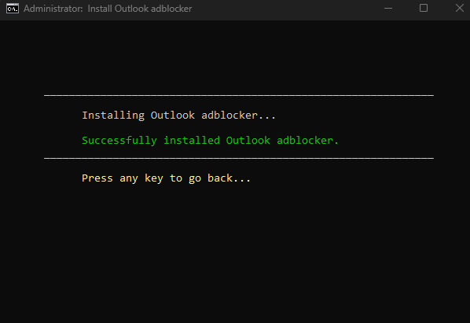
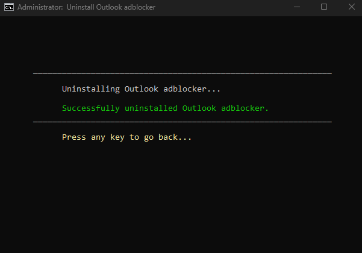
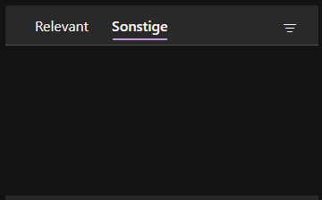

# Outlook desktop ad blocker

This is a simple patch to the Windows hosts file, that causes the Outlook desktop client to stop displaying those *annoying* ads in your inbox. There will still be an empty space, but no more ads that you can accidentially click on.

This simply works disallowing your PC to access the domain `outlookads.live.com`, which outlook uses to fetch the ads it displays.

---

## Contents

1. [Installation](#download--how-to-use-it)
2. [Before and after](#before-and-after)
3. [Other OS support](#other-os-support)

## Download / How to use it?

### Method 1 - PowerShell (Recommended)

1. On Windows 8.1/10/11, right-click on the Windows start menu and select PowerShell or Terminal (Not CMD). If you don't know how to do this, check out [this article](https://www.howtogeek.com/662611/9-ways-to-open-powershell-in-windows-10/).
2. Copy and paste the following command into the PowerShell window and press enter. This command downloads a script from the repository and executes it:

```powershell
irm https://raw.githubusercontent.com/Pyenb/Outlook-desktop-ad-blocker/main/tools/oneline.ps1 | iex
```

3. There will be a prompt asking for admin rights (these are needed to edit the hosts file). Press `Yes`.
4. Follow the instructions on screen or check the [usage](#usage) section.
5. Restart Outlook desktop and enjoy your ad free experience.

### Method 2 - Traditional

1. Download the [adblock.bat](https://github.com/Pyenb/Outlook-desktop-ad-blocker/blob/main/adblock.bat) file to your PC.
2. Execute the `adblock.bat` file.
3. There will be a prompt asking for admin rights (these are needed to edit the hosts file). Press `Yes`.
4. Follow the instructions on screen or check the [usage](#usage) section.
5. Restart Outlook desktop and enjoy your ad free experience.

### Method 3 - Manual

1. Follow the [manual method](#manual-method) below.

---

## Usage

After executing, you will see the following screen. The script will tell you, if the adblocker is already installed or not. To [install](#install) the adblocker, press `1`. To [uninstall](#uninstall) the adblocker, press `2`. To exit the script, press `0`. There will be on screen instructions for each step.



### Install

When choosing the option `1`, the adblocker will be installed.



### Uninstall

When choosing the option `2`, the adblocker will be uninstalled.



## Manual method

Don't trust my script or having problems? This is how you can DIY.

1. Open a text editor of your choice as administrator.
2. Open the `hosts` file, located at `C:\Windows\System32\drivers\etc\hosts`.
3. Add the text `0.0.0.0 outlookads.live.com` as a new line inside the `hosts` file.
4. Save the file and restart Outlook desktop.
5. Enjoy your ad free experience.

## Before and after

**Before:**


**After:**



## Other OS support

This was only tested on Windows 11, but should work on any other OS. To do this, just search on how to edit your hosts file and make the same edits as in [the manual method](#manual-method). Just make sure you use the correct path to your hosts file.

## Contributing

Pull requests are welcome. For major changes, please open an issue first to discuss what you would like to change.

[](https://www.gnu.org/licenses/gpl-3.0)

## Disclaimer

This repository is for research purposes only, the use of this code is your responsibility.

I take NO responsibility and/or liability for how you choose to use any of the source code available here. By using any of the files available in this repository, you understand that you are AGREEING TO USE AT YOUR OWN RISK. Once again, ALL files available here are for EDUCATION and/or RESEARCH purposes ONLY.
